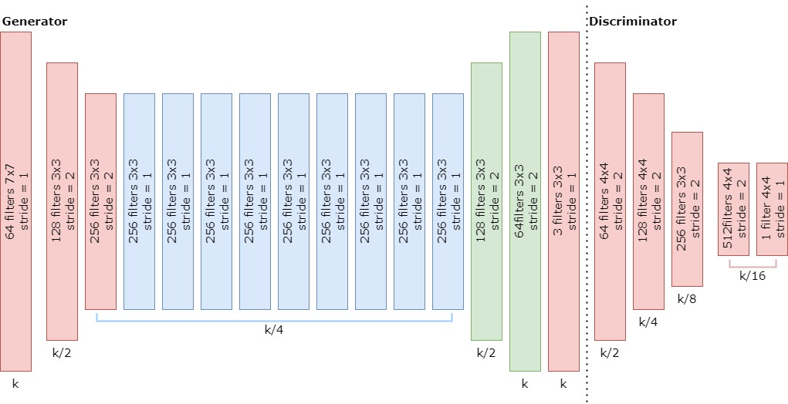

# Transform photos into monet paintings (and vice-versa) from the Kaggle competition I’m Something of a Painter Myself

## Introduction
The objective of this project is to leverage the power of GANs to generate realistic Monet-style paintings from ordinary photographs. 
GANs are a type of deep learning model that consists of a generator and a discriminator. 
The generator learns to generate new images that resemble the target domain (Monet paintings), while the discriminator tries to distinguish between real and generated images.
Through adversarial training, the generator improves over time and learns to produce high-quality Monet-style paintings.

This repository contains a notebook that demonstrates the conversion of photos into Monet-style paintings and vice-versa using a Cycle Generative Adversarial Network (cGAN). 
This project was inspired by the [Kaggle competition](https://www.kaggle.com/c/gan-getting-started) on GAN image synthesis.

## Dataset
The dataset used in this project is the [Kaggle Monet paintings dataset](https://www.kaggle.com/c/gan-getting-started/data), which consists of a collection of Monet-style paintings and photographies. 
The dataset contains a total of 300 Monet paintings and 7000+ photos (from which only 2500 were used to reduce the training time per epoch). 
Each image is of size 256 x 256 pixels.

## Methods and Techniques

### Cycle GAN 
In the case of a cycle GAN we have two generators and two discriminators that are trained together, creating a cycle (a). 
Beside the adversial loss of the generators, the generator loss also includes a cycle-consistency loss and a identity loss. 
The cycle-consistency loss consist in a L1-loss between an image obtained by passing the image through both generators and comparing the obtained image with the original (b).
The identity loss consist into passing an image of one dataset through the generator that created fake images like the ones in the same dataset (c). 
Acording to the original paper authors, this loss is used to keep the tint of the images similar, being useful to transform images into paintings and vice-versa. 

#### Building the architectures
The models' architectures is the same discribed in the [original cGAN paper](https://arxiv.org/abs/1703.10593). 
Thus, the generator consists in three convolutional layers, followed by 9 residual layers (since the images are 256x256), two transpose convolutional layers and a last convolutional layer to convert the result into RGB.
The discriminator consists in a 7x7 pathGAN with 5 convolutional layers. 

#### Training the GAN
The generator and discriminator are trained in an adversarial manner. 
The generator generates paintings, and the discriminator tries to classify them as real or fake. 
The generator's objective is to fool the discriminator, while the discriminator's objective is to accurately classify the paintings. 
This adversarial training process continues until both the generator and discriminator converge to produce high-quality Monet-style paintings.

Converting Photos to Monet Paintings: Once the GAN is trained, it can be used to convert ordinary photos into Monet-style paintings. By feeding a photo through the Monet generator, the GAN generates a corresponding Monet-style painting.

Converting Monet Paintings to Photos: Similarly, the GAN can also convert Monet paintings back into ordinary photos. By feeding a Monet painting through the Photo generator, the GAN generates a corresponding photography.

## Results
The trained GAN produces Monet-style paintings that closely resemble the artistic style of Claude Monet. 
The generated paintings exhibit vibrant colors, brush strokes, and texture similar to those found in Monet's works. 
The GAN achieves a high level of realism and successfully captures the essence of Monet's artistic style.

## Usage
To run the notebook and generate Monet-style paintings from photos or vice-versa, follow these steps:

1. Download the Kaggle Monet paintings dataset from [Kaggle](https://www.kaggle.com/c/gan-getting-started/data).
2. Install the required dependencies: 

+ PIL==9.3.0
+ matplotlib==3.5.3
+ numpy==1.21.6
+ pandas==1.3.5
+ session_info==1.0.0
+ torch==1.13.0
+ torchvision==0.14.0
+ tqdm==4.64.1
+ Python==3.7.12 

3. Open the notebook and upload the dataset.
4. Run the notebook cells sequentially to preprocess the data, train the GAN, and generate Monet-style paintings from photos or vice-versa.
5. Experiment with different parameters and architectures to further improve the results.
